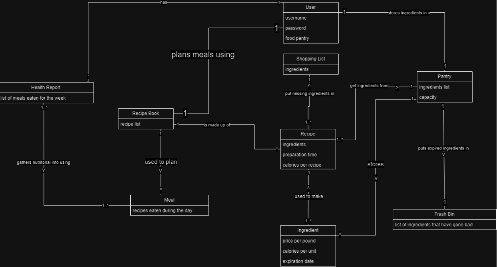

# Introduction

GreenPlate is an app designed to help reduce the waste of food, save people money by helping them utilize all of the food that they buy, and help people track their daily calorie intake. Greenplate is dedicated to aiding people in their everyday food management plans. To help create more sustainable habits, the app allows users to be able to digitally track food items in their pantry, generate recipes to help ensure that all items in the pantry get eaten, and create shopping lists so that a user does not accidentally purchase food items that already are in their pantry. By shopping and planning meals with sustainability in mind, users can save money and more affordably feed themselves and their families. In addition to eating and shopping sustainability, the GreenPlate app also provides users with information on their calorie intake. Users can use this knowledge to help them reach their eating goals and establish healthy eating habits. GreenPlate’s overarching purpose is to increase food efficiency one pantry at a time.

# Design and Architecture

### Use Case Diagram

Here we have the use case diagram for our first sprint where we were defining how primary and supporting actors would interact with the app, and who could potentially be supporting the development and production of the app. The user being a primary actor in this diagram interacts with the app by logging into the app, entering in their calorie intake to be recorded, adding items to their shopping list, and selecting a recipe to cook. Understanding how the different actors such as the user interact with the system allowed the development of the GreenPlate app to go smoothly by providing a consistent description of what needed to be implemented down the road. 

### Domain Model
This is the Domain model that we developed early on in the project to be able to define the different classes and their different attributes. This domain model was created in order to bridge the written description of what GreenPlate was going to be to something easy to understand when generating software. The domain model was useful as well to help understand how the different classes will interact with one another such as how classes will interact with an interface.

### MVVM Architecture
In our project we decided to use MVVM as our architecture. This is mainly because it was the preferred development pattern for Android mobile development. In our model, we have around 9 classes representing important concepts in our system. Namely, Ingredients, Recipes, and Meals, which represent the food; a Pantry which stores the food; a RecipeBook and Health Report to keep track of meals eaten in the past and future. There is also a Trash Bin that keeps track of food wasted. This is the internal workings of our system, however, we need to keep our system responsive to the user, and let the user update the system while the system notifies the user of what actions they can take. We created Model classes (located in the modelfolder) to keep track of any internal classes used by the system. We then made ViewModels (kept in the viewmodels folder)  which would be an intermediate layer for communicating between the internal system models and the user inputs. Finally, we have Views (located in the views folder), which represent the visual GUI that the user will interact with. The Views folder holds the classes which implement the logic for making GUI components work. Along with the Views folder is the res/layout folder, which lays out all the components of the GUI that the app will use.

### Updated Domain Model
This is the updated Domain model that we created in the second sprint of the project to be able to further define the relationships between the classes we already had, and the new ones that we added. The updated model allowed for a better understanding of how the new classes will be included within the scope of our current implementation, and what attributes that they contain.

